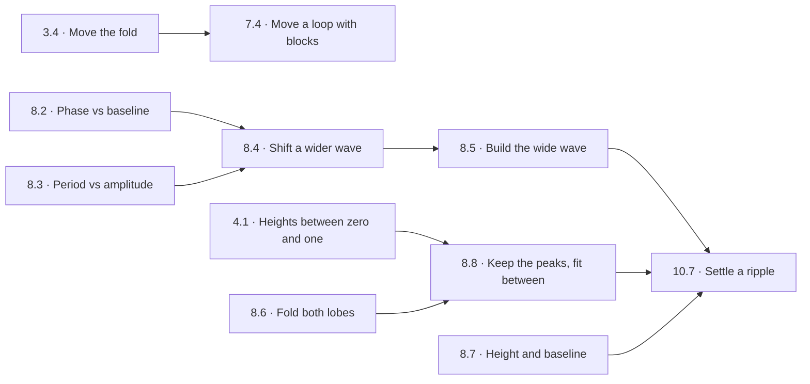

# Learning dependencies

`content/learning-path.json` owns the ten chapter orders and the prerequisite edges for all 83 sources. The main route contains 69 lessons; fourteen preserved sources are optional. `web/src/types.ts` consumes the order, and authored Notes selects the current lesson and its direct prerequisite references. Create/shared challenges retain the complete book. There is one Notes destination, not another accumulated-knowledge menu.

These edges are teaching hypotheses. A solve, an exhaustive recipe count, or an acyclic graph does not establish understanding. Observe a prediction before a move and a transfer to changed targets; distinguish mathematical uncertainty from trouble reading or operating the interface.

An accumulated-knowledge button does not yet earn a separate place in puzzle play. A chronological list makes players search past unrelated lessons, while the current lesson and direct prerequisites answer the immediate recall question. Completion is also a poor proxy for what someone understands, particularly after replay or a deep link. Create's complete book serves open exploration, and the puzzle selector already supports revisiting earlier work. Reconsider a broader in-puzzle index if playtests show players repeatedly seeking an earlier relationship that the relevant references cannot reach; do not infer that need merely from the growing number of lessons.

## Closing the late-chapter gaps

The circle offset lesson changes the input zero before Square; it teaches horizontal centre placement through the existing rail. Adding to a squared-height result changes the two branches’ reach, not their vertical centre. Parameter circles still teach two-axis translation separately.

8.3 already isolated halving before sine. The missing bridge was transfer: 8.4 compares input shift/scale order, then 8.5 removes the fixed sine station in a small search space. 8.8 starts with five exact matches and one off-peak miss. Squaring preserves zero and one while lowering intermediate heights, connecting Flat tops to wave repair. 10.7 references these precise lessons rather than the entire knowledge history.

## Exact audit

`python3 tests/learning_path_oracle.py` uses independent exact arithmetic, not the game kernel. It exhausts six added legal spaces, including station boundaries and all prefixes:

| Source / lesson | Legal constructions | Exact solutions | Shortest length |
| --- | ---: | --- | ---: |
| 78 / 7.4 | 14 | `AQNA` | 4 |
| 79 / 8.4 | 5 | `AHS` | 3 |
| 80 / 8.8 | 4 | `Q` | 1 |
| 81 / 8.5 | 35 | `HAS`, `AAHS` | 3 |
| 82 / 10.1 | 3 | `H` | 1 |
| 83 / 10.6 | 3 | `Q` | 1 |

No candidate in these spaces was unsupported. The shorter `HAS` is welcome: it still centres and scales the input before movable sine. A longer witness is not a success rule. Witnesses appear in tests/docs only, never in shipped puzzle metadata.

At source 80, the initial squared sine agrees at all five zero/peak landmarks but gives `1/4` instead of `1/16` at `x=1/3`. Squaring fixes that point and preserves the five matches. At source 76, `QHNA` matches three targets but gives `7/8` rather than `(2+sqrt(2))/4` at `x=3/2`; `ASAH` matches all four. Rounded display agreement never establishes a hit. These two comparisons motivate preserving known matches while inspecting the missing relationship.

## Complete dependency record

Each edge names a directly useful earlier lesson, not every operation that happens to occur in a solution. Optional entries use stable source IDs because they have no main-route number.

| Source | Lesson | Direct prerequisites | Relationship |
| ---: | --- | --- | --- |
| 1 | 1.1 | — | Scale preserves zeros |
| 2 | 1.2 | 1.1 | A lift preserves height differences |
| 3 | 1.3 | 1.1, 1.2 | A later scale changes an earlier lift |
| 24 | 1.4 | 1.3 | Interleave lifts and scales for fractional baselines |
| 25 | 1.5 | 1.4 | Separate height gap from baseline |
| 6 | 2.1 | 1.1 | Reflection reverses signed height |
| 8 | 2.2 | 2.1, 1.2 | Place a reflected bowl |
| 9 | 2.3 | 2.2, 1.1 | Scale a bowl before placing its roof |
| 26 | 2.4 | 2.3, 1.4 | Account for an existing offset |
| 7 | 3.1 | 2.1 | Squaring folds signed heights together |
| 10 | 3.2 | 3.1, 1.1 | Scaling before a square changes its result twice |
| 4 | 3.3 | 3.2, 2.2 | Build a roof from a line |
| 27 | 3.4 | 3.1, 1.3 | The zero before squaring sets the fold position |
| 28 | 3.5 | 3.4, 2.3, 1.4 | Fit an off-centre arch |
| 12 | 4.1 | 3.1, 1.1 | Squaring fixes zero and one but lowers heights between them |
| 13 | 4.2 | 4.1, 2.2 | Turn a flattened bowl into a roof |
| 29 | 4.3 | 4.1 | Squaring a cubic produces a sixth power |
| 30 | 4.4 | 4.3, 4.2 | Transfer the roof finish to a sixth power |
| 31 | 4.5 | 4.1, 3.2, 1.4 | Normalize a bowl before repeated flattening |
| 11 | 4.6 | 4.5, 3.3 | Construct and flatten the bowl |
| 32 | 5.1 | 1.3, 2.2 | Input height and output slope are different quantities |
| 33 | 5.2 | 5.1, 3.1 | A fold creates a changing slope |
| 34 | 5.3 | 5.2, 3.4 | Moving an input turning point moves its zero slope |
| 35 | 5.4 | 5.2, 4.1 | Several flat places become several slope zeros |
| 36 | 5.5 | 5.3, 5.4, 1.5 | Shape the input and fit the slope output |
| 37 | 6.1 | 1.2 | Input height controls growth of anchored area |
| 38 | 6.2 | 6.1, 3.4 | Signed area cancels across a shifted zero |
| 39 | 6.3 | 6.2, 3.3 | Several sign regions alternate growth and loss |
| 40 | 6.4 | 6.1, 1.3 | Scale accumulated change separately from its starting height |
| 41 | 6.5 | 5.1, 6.4 | Accumulation recovers change but not the lost constant |
| 42 | 6.6 | 6.3, 6.4, 3.5 | Place input signs and then fit accumulated output |
| 43 | 7.1 | 2.3 | A circle keeps a fixed distance from its centre |
| 44 | 7.2 | 7.1 | Translate the centre without changing the radius |
| 48 | 7.3 | 7.1, 3.3 | A roof can define both signs of height |
| 78 | 7.4 | 7.3, 7.2, 3.4 | An input shift before Square moves the loop centre |
| 68 | 7.5 | 7.3, 1.2 | Adding squared height separates the branches |
| 69 | 7.6 | 7.5, 3.2 | Two squared-height halves halve visible height |
| 70 | 7.7 | 7.3, 2.1 | Real branches exist only where the right side is nonnegative |
| 66 | 7.8 | 7.3, 4.1 | A roof and its square have different cap shapes |
| 49 | 7.9 | 7.4, 7.6, 7.1 | Translate geometric centre and radius into a block-built roof |
| 71 | 7.10 | 7.9, 7.7, 7.8, 1.4 | A signed roof and magnitude operation create several visible pieces |
| 50 | 8.1 | 7.1 | Sine projects quarter-turn input onto height |
| 51 | 8.2 | 8.1, 1.3 | Input shift moves phase; output lift moves baseline |
| 52 | 8.3 | 8.1, 1.1 | Input scale changes period; output scale changes amplitude |
| 79 | 8.4 | 8.2, 8.3, 1.3 | An input scale also scales an earlier phase shift |
| 81 | 8.5 | 8.4 | Rebuild input scaling when the sine block is movable |
| 53 | 8.6 | 8.1, 3.1 | Squaring folds signed wave lobes and keeps their zeros |
| 54 | 8.7 | 8.6, 1.5 | Fit a folded wave amplitude and baseline |
| 80 | 8.8 | 8.6, 4.1 | Shared peaks do not determine the heights between them |
| 55 | 8.9 | 8.5, 8.7, 8.8 | Locate wave landmarks before fitting its vertical range |
| 56 | 9.1 | 1.1 | Floor holds the integer below an input |
| 57 | 9.2 | 9.1 | Ceiling differs between integer thresholds |
| 58 | 9.3 | 9.2, 2.1 | Negation before rounding changes threshold ownership |
| 59 | 9.4 | 9.1, 8.3 | Input scale changes step width; output scale changes step height |
| 60 | 9.5 | 9.4, 8.4 | A scaled input lift shifts thresholds |
| 61 | 9.6 | 9.1, 8.1 | Integer phases project through the sine cycle |
| 62 | 9.7 | 9.6, 6.2 | Signed constant steps accumulate into straight pieces |
| 63 | 9.8 | 9.7, 9.5, 1.5 | Shape a continuous result from discontinuous input |
| 82 | 10.1 | 1.1 | Scale a straight line into a bamboo support |
| 72 | 10.2 | 8.3, 1.1 | Scale a planted bank inside its fixed frame |
| 73 | 10.3 | 6.6, 6.4 | A cropped drawing still accumulates from zero |
| 74 | 10.4 | 7.9, 7.6 | Fit circular width and squared-height thickness |
| 75 | 10.5 | 7.8, 3.5 | A squared roof gives a pointed leaf |
| 83 | 10.6 | 10.5, 7.8 | Reuse a pointed leaf as one repeated flower petal |
| 76 | 10.7 | 8.5, 8.4, 8.7, 8.8 | Distinguish phase and period from amplitude and baseline at extra landmarks |
| 77 | 10.8 | 4.5, 7.8, 7.6 | Combine a broad roof with rounded caps and fitted thickness |
| 64 | 10.9 | 5.5, 8.9 | A nonlinear input winds sine at unequal horizontal intervals |
| 65 | 10.10 | 9.8, 9.5, 7.8 | Build a finite step window before shaping its accumulated ramp |
| 67 | 10.11 | 10.10, 10.9, 7.10, 10.8 | Connect slope, thresholds, projection, area and paired heights |
| 14 | Bonus | 5.1 | Read the slope of a bowl |
| 5 | Bonus | Bonus source 14, 2.3 | Fit the slope of a cubic |
| 15 | Bonus | Bonus source 5, 3.3 | Find and fit the roof hidden in a derivative |
| 22 | Bonus | Bonus source 15, 4.5 | Repeatedly flatten a derivative |
| 16 | Bonus | 6.1 | Read positive accumulated area |
| 19 | Bonus | Bonus source 16, 6.2 | Cancel signed accumulated area |
| 17 | Bonus | Bonus source 19, 6.4 | Fit the accumulated range |
| 20 | Bonus | Bonus source 17, 1.2 | Choose a new starting amount |
| 21 | Bonus | Bonus source 20, 6.5 | Recover a curve from its slope |
| 18 | Bonus | Bonus source 21, 3.5 | Turn an accumulated shape into a roof |
| 23 | Bonus | Bonus source 18, 6.6 | Centre and fold an accumulated S curve |
| 45 | Bonus | 7.2 | Opposite diameter endpoints determine centre and radius |
| 46 | Bonus | Bonus source 45 | Two perpendicular bisectors locate a centre |
| 47 | Bonus | Bonus source 46 | Transfer equal-distance geometry to a new constellation |

## Playtest prompts

- Before changing input order, predict whether the next peak moves, rises, or both. Transfer to a different starting offset without a fixed station.
- Before repairing an off-peak miss, name the points that must stay fixed and a transformation that preserves them. Transfer to a different fractional position.
- Before moving a loop with blocks, predict which incoming zero becomes its centre. Contrast this with adding to squared height.
- After a hint, ask for the reason for the next edit. Successful continuation alone is not evidence of a learned relationship.
